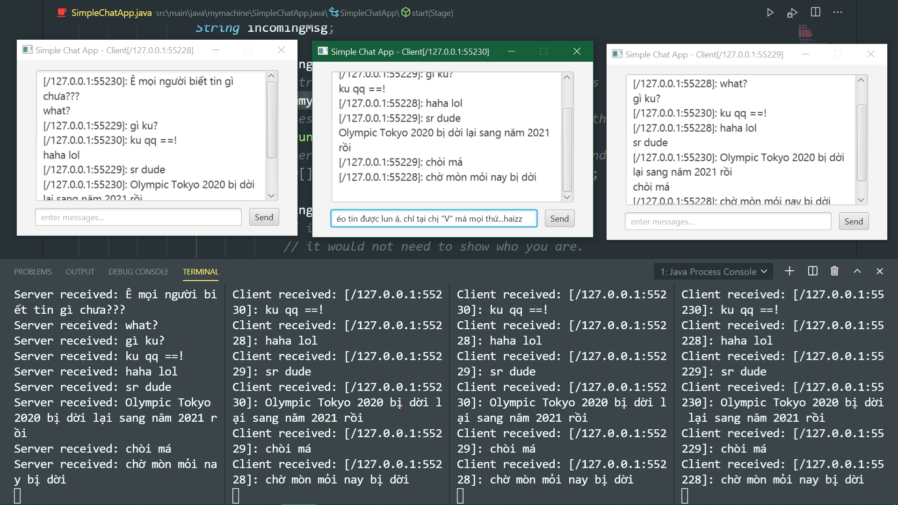

* Simple Chat Application.

* (Require Java 8 or higher and Maven for using JavaFX API)
Server side app must be running before running any client. 
To stop running the server, press Ctr + C in terminal.
Run each new client in each new terminal by using LaunchHelper.

* Use it to impress your crush. Have a nice moment, good luck !^^.

